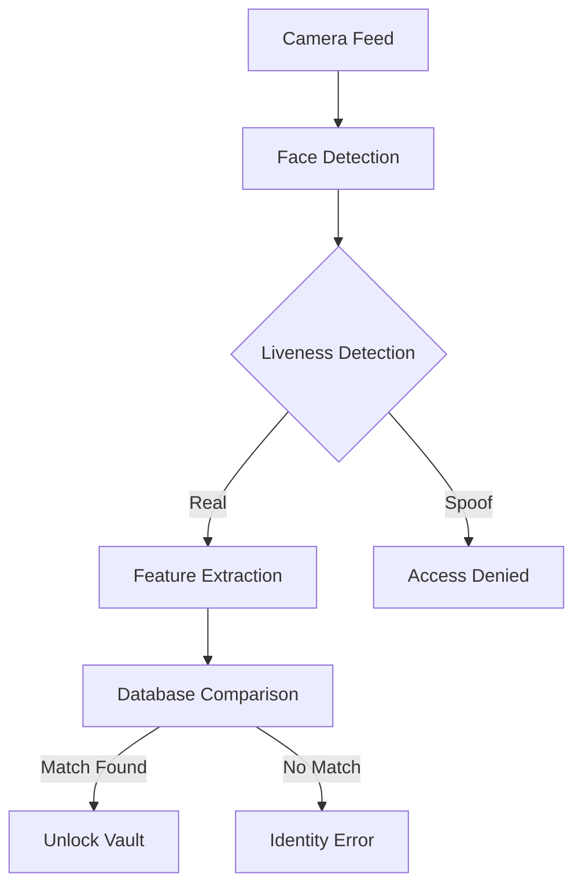

# 🛡️ Face Vault - Biometric Password Manager

Face Vault is a next-generation desktop application for securely managing your passwords, protected by your own identity. It combines modern web technologies with advanced AI-powered facial recognition to ensure that your passwords remain yours alone.

## ✨ Key Features

*   **⚡ Biometric Security**: Log in using your face with professional-grade recognition models.
*   **🛡️ 3D Liveness Detection (Anti-Spoofing)**: Advanced models to prevent photo/video-based spoofing attempts.
*   **🚀 GPU Acceleration**: Fully optimized for Windows using **DirectML**, leveraging any GPU (NVIDIA, AMD, Intel) for lightning-fast scanning.
*   **📂 Secure Local Storage**: Your data stays on your machine, encrypted in a local SQLite database.
*   **🎭 Dual Authentication**: Seamlessly switch between Face ID and a traditional Master Password.
*   **🌈 Modern UI/UX**: Sleek, glassmorphic design built with React and Framer Motion elements.

---

## 🏗️ Technology Stack

### **Frontend & Application Shell**
*   **Electron**: Cross-platform desktop framework.
*   **React (Vite 8.0)**: Ultra-fast frontend framework.
*   **TypeScript**: Type-safe logic for both main and renderer processes.
*   **Lucide Icons**: Premium, consistent iconography.

### **AI & Biometrics Engine (Python)**
*   **ONNX Runtime (DirectML)**: Execution engine for AI models on Windows GPUs.
*   **InsightFace**: Industry-standard library for face analysis.
*   **PyTorch**: Backing tensor computations.
*   **MiniFASNetV2**: Specialized light-weight model for anti-spoofing detection.

### **Data Management**
*   **better-sqlite3**: High-performance, synchronous SQLite driver for Node.js.

---

## 🧬 AI Models & Workflow

Face Vault uses a multi-stage AI pipeline to ensure both accuracy and security:

1.  **Face Detection**: Identifies facial coordinates in the live camera feed.
2.  **Liveness Check**: Analyzes texture and depth patterns to ensure the person is real (not a photo/mask).
3.  **Feature Extraction**: Generates a unique "Biometric Signature" from the face.
4.  **Identity Matching**: Compares the live signature against the encrypted local database using cosine similarity.

### **Workflow Diagram**


---

## 🛠️ Project Structure

*   **/electron-app**: The core application codebase.
    *   **/src**: React frontend and component library.
    *   **/electron**: Main process and Preload scripts for bridge security.
    *   **/python**: Bundled, portable Python environment for the production build.
*   **/Face Recognition**: Python scripts handling AI inference and biometric storage.
    *   `/models`: Directory for pre-trained AI weights (ONNX format).
    *   `/face_db`: Encrypted biometric templates for registered users.
*   **/release**: (Auto-generated) Contains the final Windows Installer (`.exe`).

---

## 🚀 Getting Started

### **Prerequisites**
*   Node.js (v18+)
*   Python 3.11+
*   A Windows 10/11 device with a Webcam.

### **Development Setup**
1.  **Clone the Repo**:
    ```bash
    git clone [repository-url]
    cd "Password Manager Using Face Recognition/electron-app"
    ```
2.  **Install Node Dependencies**:
    ```bash
    npm install
    ```
3.  **Configure Python Environment**:
    Create a venv and install requirements:
    ```bash
    pip install -r requirements-bundle.txt
    ```
4.  **Run in Dev Mode**:
    ```bash
    npm run dev
    ```

### **Building the Production App**
To create the final Windows Installer:
```bash
npm run electron:build
```
The installer will be generated in `electron-app/release/Face Vault Setup [version].exe`.

---

## 🔒 Privacy & Security

*   **Local-First Architecture**: Your biometrics and passwords never leave your computer. We do not use cloud storage.
*   **Encryption**: Passwords are encrypted before storage using system-level salts and a custom encryption layer.
*   **Isolation**: The AI backend runs in a separate process with limited permissions to increase security.

---

**Developed by Makious**
*Face Vault - Your Identity is the Key.*
